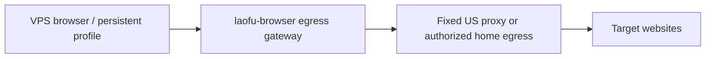

# Approved Development Plan

[简体中文](IMPLEMENTATION_PLAN.md) | **English**

> Latest authorization recorded on 2026-09-15: fix confirmed portions of the 28 class-A adversarial findings; defer B/C/D. See [fixes](ADVERSARIAL_FIXES.en.md) for implementation, acceptance, and compatibility changes. At that checkpoint, fixes and verification were complete: 50/50 unit/API, 19/19 browser, and all 24 matrix items after explicit reruns. Daily-environment upgrade, commit/push, and release freezing had not yet occurred. The P4/P5 boundaries below still apply. Consult current context for later delivery status.

Date: 2026-09-14. The user explicitly approved IMPLEMENT; this document defines execution scope.

Latest decision: archive old dev.1; verify independent installation and recovery with new dev.2, without requiring historical-package migration. Prioritize P4. P5/cross-platform/Japan deployment/automatic cross-device selection are paused and do not resume automatically after P4. G01–G11 below are a historical `main@2b2fdad` snapshot. Current implementation and evidence are in CURRENT_CONTEXT, ACCEPTANCE, and TEST_REPORT.

## Delivery

An independent project, Mac first, for internal products, with a lightweight web console. HTTP, TypeScript/Python SDKs, MCP, and CLI share the real service. Two independent clients use published packages for acceptance. Business changes to Fuyera, Qidao, and 000 are separate. This replaces the original design's two-business-product integration gate.

## Phases

| Phase | Deliverable | Exit criteria |
|---|---|---|
| P0 | Project, full schemas, fixed dependencies, comparison site, isolated execution probes | Build plus real pairing/sandbox/isolation evidence |
| P1 | Authentication, durable tasks/commands, deduplication, control, all 23 tools | Comparison and fault tests pass |
| P2 | article.capture, images/text/safe HTML/ZIP/manifest | Correct offline artifacts and partial-failure reporting |
| P3 | Five-area console, handoff, SDK/MCP/CLI, learnings/diagnostics/metering | Independent clients call the real service successfully |
| P4 | Mac candidate, full regression, install/upgrade/rollback | Actual local verification and fixed artifacts |
| P5 | Japan Ubuntu, desktop coordination, Windows/Linux | Real cross-environment acceptance and internal v1.0 |

## Defaults

Loopback plus authentication; serialized profiles, global concurrency 2; capture active 180 seconds, human 600 seconds, wall 900 seconds, HTTP wait 30 seconds; article package 50 MiB; artifact quota 10 GiB without automatic deletion; runtime logs 30 days, business commands/effects persisted separately; cookies only on execution devices.

## Protective Boundaries

Use independent service directories without overwriting Japan huashu experiments or other websites. This plan does not authorize public service/store/registry publication. Do not open restricted-product access until data/identity isolation passes. Never retry dispatched writes with unknown outcomes.

## Current User-Confirmed Scope

Complete P4 first; cross-platform and automatic cross-device selection are paused. Keep dev.1 archived without requiring verification or promising historical migration. P4 requires independent new-package installation, real execution, data preservation, fault recovery, and integrity. Reject different content with the same release ID. Linux/Windows/Japan deployment is not an exit condition here and remains incomplete.

This section supersedes earlier plans for actual old-package migration and immediate P5 after P4. Local behavior and security gates N01–N06 remain required.

## 2026-09-14 Remaining Requirements and Next Steps

This incremental plan is based on `main@2b2fdad`, retaining approved scope and P0→P5 gates. It does not claim the features below already exist or change release conclusions. Code, contracts, and historical tests were reviewed item by item; synthetic installer and Fastify probes were run. Full browser regression, network changes, and target deployment were not rerun in that review.

**Next objective: an upgradable owner-use Mac build, then restricted-product security/use acceptance and a fixed P4 release. Cross-environment P5/internal v1.0 is paused.** DNS blocks restricted products but should not prevent local upgrade, capacity, and compatibility work.

### Established Foundations and Scope

- Frozen 23 tools, 107 top-level parameters plus nested definitions; 19 behavior/HTTP checks, 23 tools, and 25 representative upstream comparisons passed. Unknown-write non-replay, profile control, atomic artifacts, and safe previews remain regression baselines.
- The then-current `2b2fdad` package passed integrity for 19,756 entries and 10 new-install/synthetic-rollback checks, with SDK and Docker import/handoff evidence added. This does not prove migration from actual old packages.
- Two external SDK clients through the owner entrypoint satisfy the approved integration method. Business-product changes are not prerequisites. Positive isolation acceptance for two **restricted identities** remains a separate requirement.
- The real WeChat single-article result of 30/30 images stands. Explicitly undownloaded audio/video is not an image-capture failure. Do not add video download, CAPTCHA handling, or arbitrary-site pagination promises.
- Manual artifact/command/profile retention is approved. Capacity management must not introduce automatic deletion of user data.

### Remaining Issues

“Confirmed” means code or probes establish the fact; “unaccepted” means missing real-scenario evidence, not necessarily missing implementation. Priority reflects impact; dependencies follow below.

| ID | User impact and fact at the time | Type / priority | Requirements and code |
|---|---|---|---|
| G01 | Different old/new Mac contents share `0.1.0-dev.1-macos-arm64`; installer rejects replacement. New install does not prove upgrade | Reproduced delivery gap / high | P4; `scripts/package-release.mjs:107`, `deploy/manage.mjs:123` |
| G02 | Latest isolation was 7/8: DNS resolved a public target to a reserved address, failing the positive path; rejection worked as designed | Environment block/diagnostic gap / high | P0, R01/R06; `src/network.ts`, `scripts/network-probe.mjs`, `deploy/isolated.mjs` |
| G03 | 429/frequency warnings stop one task only; no persistent site/account/profile/egress cooldown or cross-task Retry-After gate | Confirmed unimplemented / high | L05; `src/article.ts:265`, `src/broker.ts`, `src/store.ts` |
| G04 | Global concurrency 2, one running/waiting task per product, 10 GiB streaming quota exist; per-product disk, queue/residency/tab budgets and task-tab reclamation missing | Partial; long-run impact unmeasured / high | L06, scenario 13; `src/artifacts.ts:13`, `src/broker.ts:204`, `src/article.ts:241` |
| G05 | `execution.mode=auto` still requires profile or returns 400; only location checks, no candidate reasoning/account verification/linked device attempts | Confirmed unimplemented / high | L03; `src/contracts.ts:33`, `src/server.ts:543`, `src/types.ts:20` |
| G06 | Deletion blocks later reads/removes files but does not revoke open streams; task results lack deleted state; upload MIME validates syntax only | Partial; in-flight effect needs reproduction / high | R06, file lifecycle; `src/artifacts.ts:118`, `src/server.ts:146`, `:694` |
| G07 | Handoff has auth, Origin, one controller, revoke/reconnect; handoff ID is reusable, without single-use tickets; dual restricted-identity workflow not accepted | Requirement difference/evidence gap / high | L04, R05/R08; `src/server.ts:833`, `scripts/isolated-smoke.mjs` |
| G08 | DOM extraction and pagination/media-gap reporting exist, but no common stable-body/lazy preparation; 25 comparisons omit stale refs/canvas/dialogs/CSP/debugger/pagination anomalies | Implemented subset/evidence gap / high | L01, B01–B23, R04/R07; `src/article.ts:261`, `:447`, `scripts/upstream-parity.mjs` |
| G09 | Package/service diagnostics exist, target site fixed to not_checked; hardcoded `0.1.0` cannot identify builds; daily Chrome and all 20 hosts unaccepted | Diagnostic/manual acceptance gaps / medium | Section 4, P4; `src/cli.ts:239`, `src/server.ts:176`, `src/worker.ts:71`, `src/mcp.ts:14` |
| G10 | Linux/Windows have preparation only; deployer rejects non-Mac and fixed packager supports Mac arm64 only | Implementation/environment gaps / high, after P4 | P5; `deploy/isolated.mjs:43`, `scripts/package-release.mjs:10`, `deploy/linux/`, `deploy/windows/` |
| G11 | Evidence script hardcodes historical paths and promotes broad items to verified; regression/offline Docker/delivery checks partly depend on workspace scripts | Reproduction/status governance gap / medium | P4; `scripts/collect-evidence.mjs`, `docs/traceability.json`, `releases/DELIVERY.json` |

G01 synthetic probe: first install exited 0; second different-content/same-ID install exited 1 with “相同 releaseId 内容不同；拒绝覆盖固定版本” (same releaseId, different content; refusing to overwrite a fixed version). Actual manifests also shared the ID with different content. The user's installation was not upgraded. G05 tested acceptance only, without a browser. Raw record: `workspace/next-plan/probe-result.json`.

### Batch One: Owner Mac Workflow and Isolation Diagnosis

#### N01 Fixed Release Identity and Installation Recovery (G01/G09/G11)

- Use new `0.1.0-dev.2` for the next delivery. Centralize version, SDK, Docker tag, and build identity. Never replace accepted fixed artifacts with different content under one ID; rebuilds go to candidate directories.
- Keep same-ID/different-content rejection. Fix generation/versioning instead of deleting old installations to bypass it.
- Move final-package verification, delivery manifests, and offline-image builds into `scripts/`, taking explicit commit/source-image/output inputs and preserving failure logs/nonzero exits. `collect-evidence` takes the current manifest; no implicit old evidence or promotion from one sample to broad verified status.
- Scope: package/SDK metadata, generators, `scripts/package-release.mjs`, `deploy/manage.mjs`, `scripts/install-regression.mjs`, runtime versions, and docs. Keep API-contract version distinct from software build version.
- Acceptance: independent-prefix install/start/capture/stop/restart preserving tasks/artifacts/idempotency; tampering and ID conflicts rejected; dedicated candidates test failed-switch recovery without requiring dev.1 migration; API/CLI/MCP/worker/RELEASE/DELIVERY trace one commit.

#### N02 Complete Isolation Probes and Environment Repair (G02)

- Put all eight probes and failure aggregation in normal scripts, preserving other results when one fails. Separate DNS addresses, proxy rejection, TCP/TLS, browser access, and sandbox conclusions.
- Prefer the authorized existing network path; inspect host, Docker, and gateway DNS in order. Additional resolvers/proxies/host changes require explicit configuration and authorization for the actual objects. This plan chooses no external DoH service and authorizes no new domain-data transmission.
- Continue rejecting private/reserved DNS results and pin connections to verified addresses. Do not disable sandboxing, allow `198.18/15`, or substitute a green report.
- Acceptance: all eight real checks plus IPv4/IPv6, redirects, iframe/subresources, fetch, WebSocket, and native-download private-network rejection. Restart invalidates old proof; reverify before restricted access.
- If networking remains unavailable, identify the failed layer, keep restricted access closed, and continue N01/N03/N04/N06 without repeating the same failed route.

#### N03 Explicit Account Scope, Persistent Limits, and Capacity (G03/G04/G05)

- Bind/verify site/account scope for explicit profiles. Mark public account-free tasks anonymous. Obtain execution-side account evidence where required; unknown waits for a person. A profile name is not identity proof. Keep fingerprints controlled; expose only conclusions.
- Persist cooldowns by site and bound account/profile/egress. New task/keys cannot bypass them. Preserve raw/parsed trusted Retry-After and enforce it; without a trustworthy recovery time, require explicit recovery rather than guessing.
- Check cooldown at acceptance, before execution, and on human continuation. Persist through restart; clearing cooldown cannot revive terminal/unknown writes.
- Preserve global 10 GiB/product execution isolation. Add configurable product disk, queue, and resident-task budgets with reservations. Other budgeted products continue while one waits for a person.
- Manage only task-created tabs: reclaim successfully delivered capture tabs according to policy; preserve waiting, uncertain, and existing user tabs. At the cap, stop/refuse new tabs without silently closing others.
- Scope: `src/types.ts`, `store.ts`, `broker.ts`, `article.ts`, `worker.ts`, `artifacts.ts`, `contracts.ts`, `web/main.tsx`. Use explicit testable defaults, measure controlled capacity samples, and never delete old artifacts/profiles by default.
- Acceptance: second same-site task blocked by cooldown, including restart/continuation; independent queue/disk limits; 30 captures respect managed-tab caps and preserve user tabs. A single RSS number does not prove resources were released.

Batch-one delivery: a new independent version with install/recovery evidence, reproducible network diagnosis, and cross-task cooldown/capacity behavior. N02 must provide actionable diagnosis even if external networking remains blocked; do not declare P0/P4 passed then.

### Batch Two: Restricted-Product Workflow and P4 Candidate

#### N04 Artifact Revocation and Article Scope (G06/G08)

- Track active downloads. Deletion/revocation rejects new requests and closes unfinished server streams. Preserve artifact ID/deleted state/reason in tasks; bytes already downloaded cannot be recalled.
- Retain declared MIME and detect supported actual formats. Unknown formats download as `application/octet-stream`, without presumed safe preview. Keep image decoding limits.
- Add bounded load/stability checks within authorized visible content. Record unstable, paginated, collapsed, or changed content as missing/uncertain; do not click unknown controls or cross paid access.
- Keep `article.capture@v1` scoped to the visible document. Define optional scope/budgets before later automatic expansion/pagination. This round verifies faithful saving and gap reporting, not universal full-site text.
- Scope: artifacts/server/article/worker and HTTP/article regressions. Test deletion during slow downloads, queried deleted state, spoofed MIME excluded from executable previews, and delayed/lazy/changing/paginated/broken-image/unsupported-media fixtures.

#### N05 Two Restricted Identities and Handoff (G07; Requires N02)

- Use a real isolated profile/container/volume/desktop per identity, never owner tokens or manually set `isolationVerified=true` as acceptance substitutes.
- Separate handoff records from short-lived single-use identity/task/profile tickets. Reconnect issues a new ticket; cancel/expire/revoke removes underlying input. Retain Origin/single-controller checks. Provide an explicit controller mode, not a misleading read-only viewer.
- Use two SDKs with distinct restricted identities for capture/query/upload/download/cancel/wait/continue/recovery and reject crossed task/profile/file/handoff access. Synthetic markers in pages, cookies, files, and screenshots expose leakage.
- Verify required-account mismatch/unknown stops; anonymous public tasks need no pointless confirmation; another identity proceeds during waiting/over-budget; revoked tickets cannot input; public success and egress rejection both hold.
- Scope: isolated/sdk/handoff regression scripts, server/broker/worker/web. This verifies the independent service without modifying business consumers.

#### N06 Compatibility Evidence and Everyday Use (G08/G09/G11)

- Split B01–B23 by parameter family, success/failure, output/MIME/truncation, and effects, each tied to samples/results. Keep all 107 schema entries aligned. No Cartesian-product exhaustive test is required, but one success cannot cover a whole family.
- First cover stale refs/rerenders, cross-origin iframe/Shadow, canvas/rich text/dialogs, pagination repeats/empty/ignored cursor, debugger contention/CSP failure, long-command timeout/revocation, shared-connection routing, SSE/permission revocation, and error/screenshot redaction.
- Compare original and adapted engines on identical inputs/pages/criteria. Classify accepted_difference/upstream_defect/blocker. Fix confirmed defects only; keep vendor immutable.
- Add optional bounded site diagnostics to doctor; unrequested sites remain unchecked. Distinguish versions, profile availability, unverified accounts, network denial, and site blocks to avoid repeated CAPTCHA attempts.
- Verify daily Chrome extension loading, one authorized read, and browser survival after worker stop. Prove install/call/uninstall in one actual host first. Track configuration support for 20 hosts separately from running those applications; unavailable hosts remain unaccepted.
- Scope: existing tests/regression/parity scripts, hosts/CLI, and traceability. Add repository-owned article fixtures; make historical WeChat inputs optional so clean clones do not depend on another project's absolute paths.

P4 exit: required N01–N06 closed with owner-Mac and two-restricted-identity evidence, full matrix, and fixed commit/artifacts. Overall pass rates cannot offset install/recovery, resource, or critical compatibility gaps. Unavailable hosts remain in the full-coverage/P5 list. Do not call a candidate complete v1.0.

### Paused: Worker Selection and Cross-Environment P5

#### N07 Device Policy and Account Verification (G05)

- Reuse explicit account binding/verification from N03/N05; map authorized accounts across devices without inferring identity from browser names.
- Implement real `auto` using only preauthorized candidates, returning profile/location/reason or explicit unavailability. Preserve explicit-profile compatibility; server never silently falls back to desktop.
- Initially no automatic cross-device retry. Create an explicit linked attempt only after verifying old execution stopped, effects, and authorization. Keep logical taskId with independent attemptId and `taskId/index/workerId/profileId/previousAttemptId/state/effectState/checkpoint`; store currentAttemptId. A new taskId plus parentId is not the same-task attempt model.
- Query current/history summaries. Cancel stops current and future attempts. SSE stays monotonically increasing with attemptId. Late results only add evidence; terminal tasks reject attempts. Migrate old data to attempt 1 without changing taskId/idempotency mappings.
- Proposed `POST /v1/tasks/:id/attempts` needs a stable key and authorized target profile. Reject unconfirmed old stop, unverified unknown effects, account mismatch, revoked caller, or terminal task. Never migrate cookies/running JavaScript or replay unknown writes.
- Scope: types/contracts/server/store/broker/worker, SDKs/MCP/CLI/devices. Verify unauthorized candidates and location violations rejected, account uncertainty stops, stable taskId/distinct attemptId with history, terminal-state protection, and no duplicate submissions.

#### N08 Target-System Implementation and Evidence (G10; Requires P4)

- Japan Ubuntu 24.04 x86_64: separate directory/user/ports, native dependencies/fixed browser, service address/tunnel or existing internal control plane, Linux gateway, isolated virtual display, service lifecycle/install/rollback. Removing the Mac guard is not Linux support.
- Windows 11 x86_64: native Node/dependencies/browser, paths/locks/signals/process stop, autostart, extension loading, same matrix. Linux desktop and 20-host matrices remain separate; unavailable systems stay gaps.
- Service/workers use N07 device identity/location. Verify server article packages on legal public pages, correct stop/handoff on blocked sites, and tunnel/worker/service recovery and upgrade independent of an agent turn.
- Encrypt controlled profile backups, verify restored permissions/account ownership in isolated copies, and never roll back business command/effect records with software.
- Acceptance binds installation, 23 tools/parameter families, articles, handoff, faults, isolation, and upgrades to actual OS/architecture/commit. Preserve old experiments/business services; internal v1.0 requires results for all coverage gaps.

### Order, Effort, and Recovery

Dependencies: `N02 → N05`; `N01 + N03 + N04 + N05 + N06 → P4`; `P4 → N07/N08 → P5`. N07/N08 remain paused, including preparatory cross-device simulations/deployment, until the user resumes them. N01/N03/N04/N06 can proceed without public-network isolation passing first.

| Work package | Estimated effort | Uncertainty / split |
|---|---|---|
| N01 | Medium | Version/generators, real two-package install/rollback, artifact/runtime identity |
| N02 | Diagnosis; no estimate for external waiting | DNS/probes first, network changes separately, full egress acceptance later |
| N03 | Large, three slices | Account verification; cooldown/recovery; capacity/queue/tabs/fairness |
| N04 | Medium | Stream revocation/state, MIME, stable article fixtures |
| N05 | Large, two commits | Tickets/revocation; dual-identity workflows/adversarial cases |
| N06 | Large, parameter-family batches | Gap matrix and comparisons; real host/Chrome access |
| N07 | Large, three slices | Device/account mapping; routing; linked attempts |
| N08 | Large, by target OS | Linux control plane/packaging/live tests; Windows packaging/process/live tests; full matrix |

Do not invent finish dates without environment evidence. Calibrate from N01/N02 completion. List external network, Windows hardware, and owner-browser interaction as dependencies, not completed development.

For behavior changes, reproduce failure or define contract tests before real scenarios. Reuse valid unchanged evidence. Software rollback switches programs without deleting profiles or replaying commands. Version/migrate/back up persistent state rather than only changing a schema constant. Restore only network configuration explicitly changed in this task; keep restricted access closed on failure.

### Inputs Needed by Phase

1. Before N02 network changes, identify usable authorized routes and permitted configuration targets; separately authorize a required external resolver and the data sent.
2. N06 needs extension loading/login in the target owner browser/host, using test or authorized pages without moving credentials.
3. N08 needs Windows 11 x86_64 and isolated Japan deployment resources. Other slices may proceed when one is missing, but P5 remains incomplete.

This plan itself does not authorize public repositories, GitHub Releases, stores/registries, business-consumer changes, or removal of site restrictions.

## 2026-09-15 US Residential Egress Assessment (Proposal, Not Implemented)

The objective is a stable US egress for a VPS browser retaining account state. This assessment only researched integration/purchase conditions: no purchase, proxy configuration, VPS deployment, or automatic resumption of P5. The user confirmed Japan Ubuntu and targets WeChat, Xiaohongshu, Codex, and Claude. Live inspection on September 15 confirmed Ubuntu 24.04.4 LTS x86_64; exact Codex/Claude entrypoints still needed clarification. The external references below document that assessment, not a fresh verification of current provider policies.

### Facts and Interpretation

- **The original Japan evidence was found and reviewed.** On September 14, huashu 1.2.0, bridge, and extension worked; the article redirected to `wappoc_appmsgcaptcha`, with screenshot/text requesting environment verification. Headed mode with the same profile and owner backend login still redirected. After the owner reported frequent-operation warnings, automated attempts stopped. The desktop read the same article's 5,325 characters and 11 images; Japan independently downloaded known originals with identical bytes. Experiment/login/screenshot/desktop records remain private. Rereading them is not a new article visit.
- Reaching WeChat's verification page rules out DNS failure as that event's explanation. Egress reputation deserves a controlled comparison, but OS/browser/configuration/history also differed. Without changing only egress on the same VPS browser or a WeChat attribution, datacenter IP is not proven the sole cause. Headed mode/backend login being insufficient does not rule out all automation/session factors.
- Later project isolation tests ran on Mac Docker Desktop/Linux arm64. Historical `docs/evidence/isolation.json` rejected reserved DNS address `198.18.1.151` in a separate environment; current `docs/evidence/p4/clean-isolated.json` passes public access/isolation. Using that earlier record to explain Japan verification mixed evidence; this section corrects it.
- **September 15 live inspection completed.** The old SSH key path failed; the supplied replacement key connected explicitly without changing SSH/server configuration. Ubuntu 24.04.4 LTS x86_64 had two active pilot services, `headless:false`, no explicit proxy/proxy-server/service-level proxy environment. Direct and browser public-IP probes returned `<server-egress-ip>`; RIPEstat identified AS45102 / Alibaba. The temporary browser probe tab was closed. `navigator.webdriver = true` showed headed mode did not remove automation signals, but does not prove WeChat used that signal.
- Saved pre/post-login receipts still showed the same article verification marker. Three pre-login text/JSON hashes matched local archives. Frequent-operation warnings remain prior user feedback, not a new observed page result. No fresh WeChat visit/verification or residential comparison occurred. Datacenter egress was verified; sole IP causation was not. Redacted inspection remains privately archived.
- `deploy/isolated.mjs` sends browsers through `http://gateway:18880`; `src/network.ts` verifies public IPs then uses `http.request` / `net.connect` directly. Provider upstream connections/authentication/stable egress identities are absent. System proxy variables alone do not change this custom TCP forwarding.
- Cloud browsers with residential proxies are feasible: [Browserbase documentation](https://docs.browserbase.com/platform/identity/proxies) describes built-in residential and custom HTTP/HTTPS proxies. This does not establish how another named product works.
- IP is one factor: [Cloudflare's detection documentation](https://developers.cloudflare.com/bots/concepts/bot-score/) also describes headers, sessions, and browser signals. Judge improvement on actual target sites, not proxy connection, IP scores, or one verification-free visit.

### Suggested Routing for Japan Ubuntu and Confirmed Targets

| Scenario | Baseline | Residential trial |
|---|---|---|
| WeChat articles | Preserve Japan-blocked/desktop-readable comparison | Keep VPS browser/profile fixed and test an authorized stable egress at low frequency; do not assume US is better for Chinese content |
| Xiaohongshu public content/login | Persistent profile/fixed egress; distinguish login/account/frequency/network issues | One accepted egress per account, human verification, no Japan/US rotation within a session |
| Codex/Claude official CLI/API | Verify Japan direct auth, streaming, and disconnection causes | Explicit fixed client proxy only if reputation/path issues warrant it; browser proxy does not prove CLI routing |
| Codex/Claude web/login helper | Separate AI browser profile, consistent login-chain egress | Short stable-US trial including login subdomains/SSO/resources; decide long-term use from results |

Suggested names `jp-direct` and `us-fixed-trial` are design examples, not implemented configuration. Bind routing to profiles/clients rather than changing the VPS default route or switching automatically at CAPTCHA. Keep CLI/browser credentials in separate controlled directories even when egress is shared.

At assessment time Japan was listed in [OpenAI API regions](https://help.openai.com/en/articles/5347006-openai-api-supported-countries-and-territories), [ChatGPT regions](https://help.openai.com/en/articles/7947663-chatgpt-supported-countries), and [Anthropic API/Claude.ai regions](https://www.anthropic.com/supported-countries). This guarantees neither an IP/account nor a need for US egress. Verify region, account eligibility, and connectivity separately.

[Claude Code network documentation](https://code.claude.com/docs/en/network-config) describes HTTP/HTTPS proxy variables and excludes SOCKS. Prefer HTTP/HTTPS CONNECT procurement; SOCKS5-only needs controlled conversion. Verify actual Codex version/auth/HTTP/streaming/WebSocket paths on the VPS rather than assuming Claude variables cover everything. Test CLI connections, browser login helpers, and MCP subprocesses separately.

### Egress Options

| Option | Fit | Verify before purchase/integration |
|---|---|---|
| Fixed dedicated US ISP proxy | Small initial trial without an owned US broadband device | Actual fixed/exclusive scope, all required domains, location stability, browser login and long connections |
| Actual home broadband | Owned or explicitly authorized US home node | Provenance/authorization, uptime/bandwidth, dynamic-IP behavior; residential does not guarantee fixed IP or no verification |
| Shared rotating residential pool | Lower priority for persistent logged-in accounts | Sticky duration, offline-node rotation, domain-specific exclusivity |

“Static residential” need not mean a physical home line. [Bright Data's definition](https://docs.brightdata.com/api-reference/proxy/rotate_ips) describes ISP/static residential as datacenter-hosted ISP-registered fixed IPs, with different dedicated scopes by network. Marketing labels alone are insufficient.

A real home egress can use [Tailscale exit nodes](https://tailscale.com/docs/features/exit-nodes) or controlled WireGuard. The node itself must be on US residential broadband; tunnel software cannot create that provenance. Initially limit it to the browser gateway's isolated network space, preserving SSH/core API/other service routes.

### Proposed Topology and Implementation Slices

This topology is proposed; the running gateway still exits directly. Cookies/configuration stay in independent persistent execution volumes; egress supplies networking, not login-state storage.

1. **Upstream gateway connection.** Add explicit egress configuration to `src/network.ts`; prefer HTTP CONNECT over TLS for purchased proxies, owner-managed only. Keep the internal gateway and worker direct-egress prohibition. Inject credentials through controlled read-only secret files, not extensions/arguments/logs/Git. Preserve destination TLS validation without installing HTTPS interception roots.
2. **Actual destination validation.** Continue rejecting private/reserved/metadata destinations. Pin verified public IPs while retaining original TLS/SNI. Test provider CONNECT-to-IP support. If a provider requires hostnames and resolves again, current DNS-rebinding proof no longer applies; require equivalent enforceable egress policy or a controlled tunnel, not relaxed gateway checks.
3. **Stable identity and failures.** Bind profiles to egressId, expected country, and config version; record observed IP/time. Share cooldown scope where physical egress is shared. Stop on outage/auth failure/drift without direct fallback or rotation. Egress changes do not clear site/profile cooldowns or replay unknown writes. CAPTCHA remains human handoff.
4. **Diagnostics and full-flow acceptance.** Separate DNS, proxy handshake, TCP/TLS, HTTP refusal, and browser verification. Verify pages, iframes/subresources, extension fetch, native downloads, and WebSocket use intended egress, with IPv6/QUIC/WebRTC unable to bypass isolation. A displayed page IP is insufficient. Preserve API/SSH, fail closed on proxy loss, exclude credentials from public artifacts, and retain all eight dual-identity isolation checks.
5. **Provider sample and VPS trial.** Obtain one short-term fixed egress, verify authorized public pages, then low-frequency authorized-account login, persistence across restart, normal actions, and one human-verification recovery. Record success/verification/disconnection/latency/traffic. Keep browser/frequency comparable; do not assign every difference to IP. Suggested observation is 24–48 hours before long-term purchase; no automation or real-account trial has been started.

Actual Linux VPS deployment also depends on P5 target networking acceptance; the current deployer accepts macOS only. New egress adaptation could first be tested in Mac isolation, but this proposal does not authorize modifying the VPS or mark Linux/cross-platform passed.

### Concrete Purchase Checklist

Fixed-IP retention and exclusivity; real line/ISP ASN type; US location/drift policy; allowed target domains including login/mail/AI/WebSocket needs; HTTPS proxy or secure tunnel; CONNECT to verified destination IP; price/traffic/concurrency/fair-use limits; node provenance/authorization; trial/unreachable refund/IP replacement conditions. US egress alone does not satisfy every site's regional/account eligibility.

Order: establish direct baselines for Japan Ubuntu and the four target classes, test one fixed sample, then decide long-term purchase and implementation. Success means improved stability in authorized scenarios, retained account state, and verified egress/isolation—not zero CAPTCHA or automated bypass of third-party authentication/platform controls.
